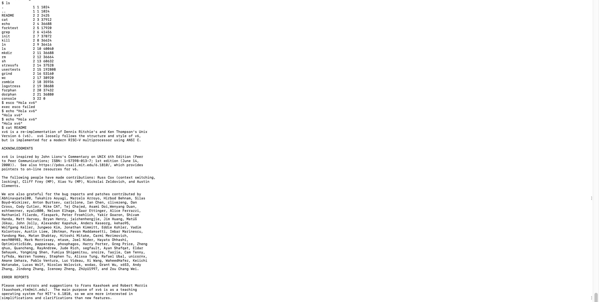

cat > INFORME.md << 'EOF'
# INFORME.md – Instalación y prueba de xv6-riscv en macOS 

## Pasos seguidos para instalar xv6 

1. Instalé **Homebrew** en macOS para gestionar las dependencias.  
2. Con Homebrew instalé:  
   - **QEMU** (para emular la arquitectura RISC-V).  
   - **riscv-gnu-toolchain** (compilador y herramientas de RISC-V).  
3. Cloné el repositorio oficial de xv6-riscv desde GitHub:  
   git clone https://github.com/mit-pdos/xv6-riscv.git  
   cd xv6-riscv  
4. Creé una nueva rama de trabajo con mi nombre de usuario:  
   git checkout -b maxsaenzm  
5. Compilé el sistema operativo con:  
   make  
6. Arranqué xv6 en QEMU con:  
   make qemu-system-riscv64  
7. Dentro de xv6 probé los comandos:  
   ls  
   echo "Hola xv6"  
   cat README  

## Problemas y soluciones  

**Problema 1:** Al intentar entrar a la carpeta xv6-riscv después del git clone, recibí el error "no such file or directory".  
**Solución:** Verifiqué en qué carpeta estaba y repetí el git clone en el directorio correcto.  

**Problema 2:** GitHub bloquea el protocolo git://, así que al principio intenté clonar con esa URL y no funcionó.  
**Solución:** Usé la versión con HTTPS (https://github.com/...).  

**Problema 3:** No tenía Homebrew instalado en el Mac, lo que impedía instalar QEMU y el toolchain de RISC-V.  
**Solución:** Instalé Homebrew y lo añadí al PATH.  

**Problema 4:** Error de tipeo al escribir echo. Puse esco y apareció "exec esco failed".  
**Solución:** Corregí el comando a echo "Hola xv6".  

## Confirmación de funcionamiento  

Los tres comandos se ejecutaron correctamente dentro de xv6:  
- `ls` mostró los archivos y programas disponibles en el sistema de archivos de xv6.  
- `echo "Hola xv6"` imprimió el texto correctamente en pantalla.  
- `cat README` desplegó el contenido del archivo README.  

Con esto se confirma que xv6 está funcionando de manera correcta en mi instalación de macOS.  
Además, se adjunta captura de pantalla que muestra la evidencia:  

