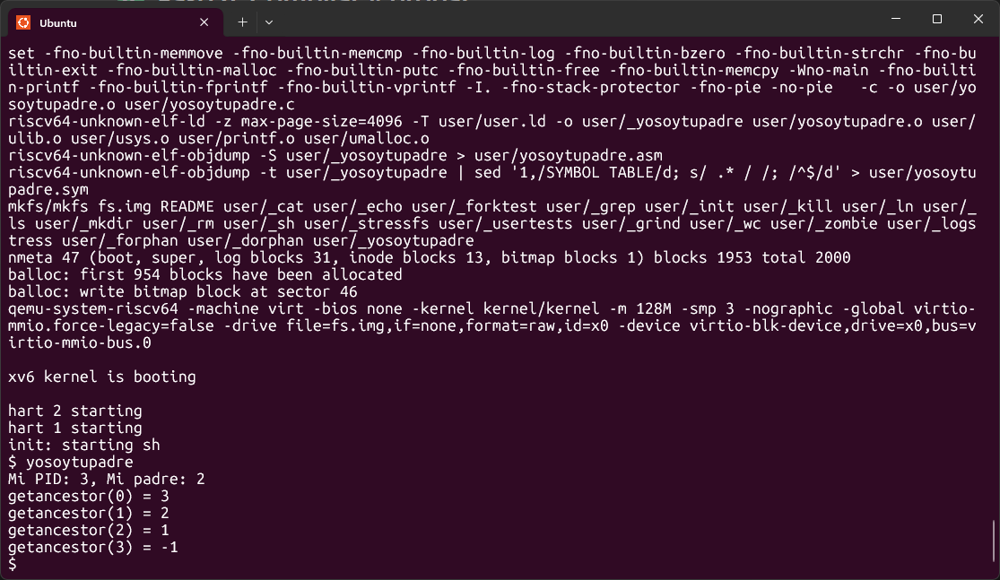

# Informe Tarea 1: Implementación de Llamadas al Sistema en xv6
Grupo Quillota-Quilpue
## Funcionalidad implementada
- `getppid()`: retorna el PID del padre.
- `getancestor(int n)`: retorna el PID del ancestro n-ésimo, o -1 si no existe.

## Archivos modificados
- `kernel/sysproc.c`: lógica de las syscalls.
### c
``` c
uint64
sys_getppid(void) {
  struct proc *p = myproc();
  if(p->parent)
    return p->parent->pid;
  return -1;  // si no tiene padre (ej: init)
}
```
- `kernel/syscall.c`: registro en la tabla.
### c
``` c
[SYS_getppid]   sys_getppid,
```
- `kernel/syscall.h`: definición de números.
### c
``` c
#define SYS_getppid  23   // (elige un número libre después de las ya definidas)
```
- `user/user.h`: prototipos.
### c
``` c
int getppid(void);
```
- `user/usys.pl`: entrada de syscall.
### c
``` c
entry("getppid");
```

## Para getancestor(int n)

- `kernel/sysproc.c`: lógica de las syscalls.
### c
``` c
uint64
sys_getancestor(void) {
  int n;
  argint(0, &n);   // recibe el parámetro n
  struct proc *p = myproc();

  for(int i = 0; i < n; i++) {
    if(p->parent == 0)  // ya no hay más ancestros
      return -1;
    p = p->parent;
  }
  return p->pid;
}
```
- `kernel/syscall.h`: definición de números.
### c
``` c
#define SYS_getppid  24   // (elige un número libre después de las ya definidas)
```
- `kernel/syscall.c`: registro en la tabla.
### c
``` c
[SYS_getancestor]   sys_getancestor,
```
- `user/user.h`: prototipos.
### c
``` c
int getancestor(int n);
```

## Programa de prueba

- `user/yosoytupadre.c`: programa de prueba.
### c
``` c
#include "kernel/types.h"
#include "kernel/stat.h"
#include "user/user.h"

int
main(int argc, char *argv[])
{
  int pid = getpid();
  int ppid = getppid();
  printf("Mi PID: %d, Mi padre: %d\n", pid, ppid);

  for (int i = 0; i < 4; i++) {
    int anc = getancestor(i);
    printf("getancestor(%d) = %d\n", i, anc);
  }

  exit(0);
}
```

## Compilado 

- `Makefile`: agregado del nuevo programa.
### c
``` c
$U/_yosoytupadre\
```

### bash
```bash
make qemu
yosoytupadre
```

## Dificultades
- Al intentar compilar xv6 después de agregar getppid() y getancestor(), apareció el error:
### bash
```bash
kernel/syscall.c:129:17: error: 'sys_getppid' undeclared here (not in a function)
kernel/syscall.c:130:21: error: 'sys_getancestor' undeclared here (not in a function)
```
Esto ocurrió porque, aunque implementamos las funciones en sysproc.c, no estaban declaradas en la sección de prototipos visibles para syscall.c.
Agregamos los prototipos de las funciones en la parte superior de syscall.c
### c
```c
extern uint64 sys_getppid(void);
extern uint64 sys_getancestor(void);
```

## Pruebas
- Se ejecutó `yosoytupadre`, mostrando PID, padre y ancestros correctamente.

