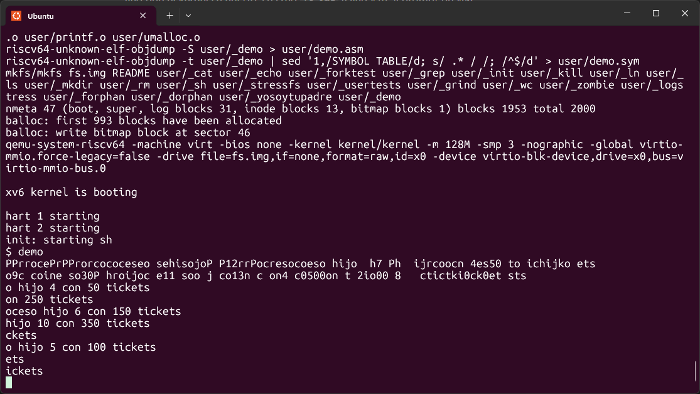

# Informe Tarea 2: Implementación de Lottery Scheduling en xv6
Grupo Quillota-Quilpue
## Funcionalidad implementada
Se modificó el sistema operativo xv6 para reemplazar el **planificador Round-Robin (RR)** por el algoritmo **Lottery Scheduling**, además de implementar:

- `settickets(int n)` → permite asignar un número de tickets a cada proceso.
- `cpu_slices` → cuenta cuántas veces un proceso fue elegido por el scheduler.
- `demo.c` → verifica la proporcionalidad de ejecución según los tickets.

## Archivos modificados
### `kernel/proc.h`
#### Se agregaron nuevos campos a la estructura `proc`:
```c
struct proc {
  // ... campos existentes ...
  int tickets;       // cantidad de tickets (>=1)
  uint64 cpu_slices; // veces que fue elegido para ejecutarse
};
```
Estos campos permiten asignar una “prioridad” (tickets) a cada proceso y medir cuántas veces obtiene la CPU.

### `kernel/proc.c`
#### Inicializacion de campos en `allocproc()`:
```c
p->tickets = 100;      // valor por defecto
if(p->tickets < 1) p->tickets = 1;
p->cpu_slices = 0;
```
#### Reemplazo del Scheduler:
El planificador Round-Robin fue reemplazado por el algoritmo de Lottery Scheduling:
```c
void
scheduler(void)
{
  struct proc *p;
  for(;;){
    intr_on();

    // 1) Calcular total de tickets entre procesos RUNNABLE
    int total = 0;
    for(p = proc; p < &proc[NPROC]; p++){
      acquire(&p->lock);
      if(p->state == RUNNABLE){
        if(p->tickets < 1) p->tickets = 1;
        total += p->tickets;
      }
      release(&p->lock);
    }

    if(total == 0)
      continue;

    // 2) Seleccionar ticket ganador
    uint64 r = kernelrand();
    int pick = (int)(r % total) + 1;

    // 3) Elegir proceso según acumulación de tickets
    int acc = 0;
    for(p = proc; p < &proc[NPROC]; p++){
      acquire(&p->lock);
      if(p->state == RUNNABLE){
        acc += p->tickets;
        if(acc >= pick){
          p->state = RUNNING;
          p->cpu_slices += 1;

          struct cpu *c = mycpu();
          c->proc = p;
          swtch(&c->context, &p->context);
          c->proc = 0;

          release(&p->lock);
          break;
        }
      }
      release(&p->lock);
    }
  }
}
```
#### Generador aleatorio simple:

```c
uint64 kernel_rand_state = 88172645463325252ULL;

static uint64
kernelrand(void)
{
  kernel_rand_state = kernel_rand_state * 6364136223846793005ULL + 1442695040888963407ULL;
  return kernel_rand_state;
}
```
Este PRNG (Linear Congruential Generator) genera valores pseudoaleatorios usados para seleccionar el ticket ganador.

### `kernel/sysproc.c` — Nueva syscall `settickets(int n)`
```c
uint64
sys_settickets(void)
{
  int n;
  if(argint(0, &n) < 0)
    return -1;
  if(n < 1) n = 1;
  struct proc *p = myproc();
  acquire(&p->lock);
  p->tickets = n;
  release(&p->lock);
  return 0;
}
```
### `kernel/syscall.h`/`kernel/syscall.c`
#### Definición del numero de syscall
```c
#define SYS_settickets 23
```
#### Registro en la tabla
```c
[SYS_settickets]   sys_settickets,
```

### `user/user.h` y `user/usys.pl`
#### Prototipo en espacio de usuario
```c
int settickets(int);
```
#### Entrada en `usyt.pl`
```c
entry("settickets");
```

## Programa de prueba - `user/demo.c`
```c
#include "kernel/types.h"
#include "user/user.h"
#include "kernel/stat.h"

int
main(int argc, char *argv[])
{
  int N = 10;
  for(int i = 0; i < N; i++){
    if(fork() == 0){
      int mytickets = 50 * (i + 1);
      settickets(mytickets);
      for(;;) {
        volatile int x;
        for(x = 0; x < 10000000; x++);
      }
      exit(0);
    }
  }

  sleep(200);
  for(int i = 0; i < N; i++)
    wait(0);

  exit(0);
}
```
Este programa crea 10 procesos, asigna diferentes cantidades de tickets y deja que el scheduler los ejecute.
El resultado esperado es que los procesos con más tickets obtengan más CPU (mayor `cpu_slices`).

## Makefile
Agregar el programa al listado de binarios:
```makefile
$U/_demo\
```
Luego compilar y ejecutar:
```makefile
make qemu
demo
```

## Dificultades
A lo largo del desarrollo del Lottery Scheduler en xv6 aparecieron varios problemas que hicieron el trabajo más desafiante. Uno de los primeros fue que el sistema no compilaba por errores en `proc.h`, ya que al agregar los nuevos campos terminé duplicando la estructura. Después aparecieron errores al agregar la syscall `settickets`, porque no estaba bien declarada o enlazada entre los distintos archivos del kernel. En algunos momentos el Makefile no encontraba el programa `demo`, y más adelante el script `usys.pl` dio errores por llamadas mal generadas. En resumen, fue un proceso con muchos detalles que corregir, donde cada cambio pequeño podía romper algo más, pero sirvió para entender mejor cómo se conectan las partes del sistema operativo.

## Pruebas
Se ejecutó el programa `demo`, el cual crea varios procesos hijos con distinta cantidad de tickets para probar el Lottery Scheduler.

Durante la ejecución se observó que los procesos con más tickets fueron elegidos con mayor frecuencia, confirmando el comportamiento esperado del algoritmo.

También se verificó que el sistema se mantuviera estable, sin bloqueos ni errores durante la asignación aleatoria de CPU.

El experimento permitió visualizar cómo el scheduler reparte el tiempo de CPU de forma proporcional a los tickets de cada proceso.

En resumen, las pruebas demostraron que la modificación del scheduler y la nueva syscall `settickets` funcionan correctamente.

