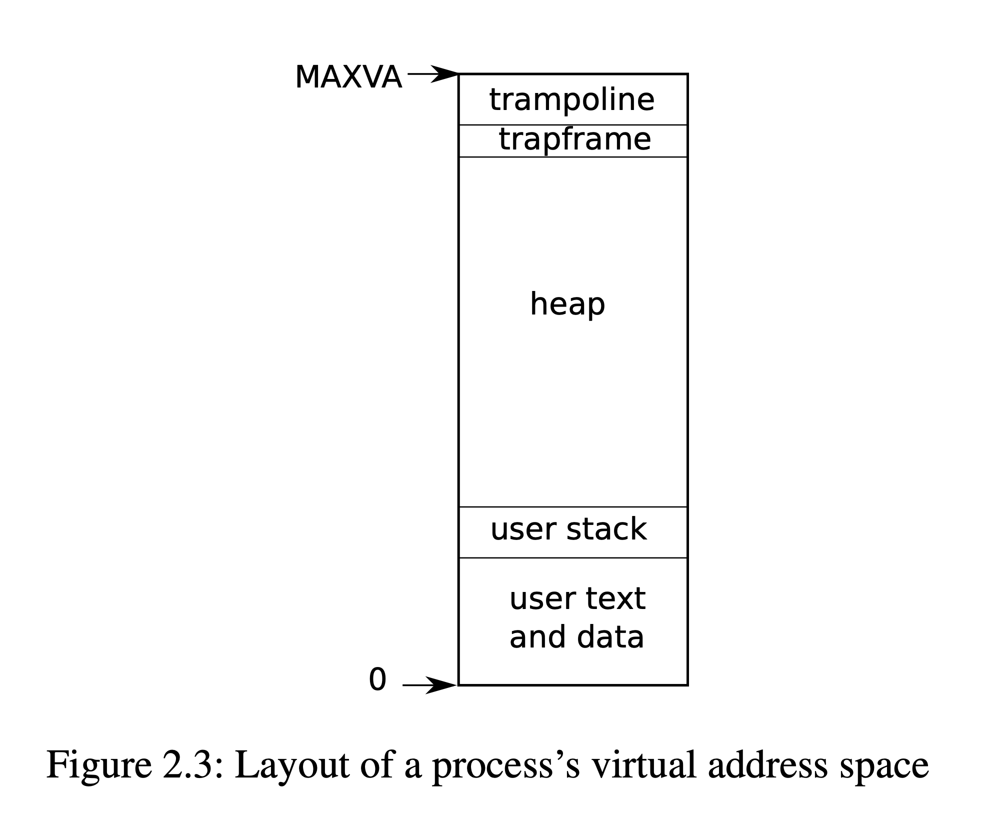
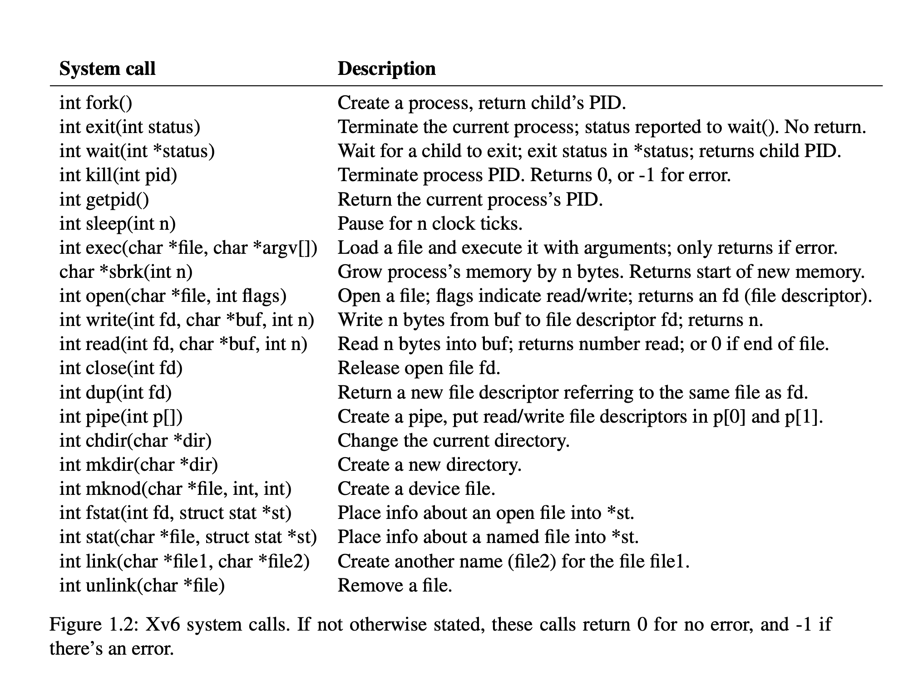

# Trap & System call

### 1. Trap

> Kernel code (assembler or C) that processes a trap is often called a ***handler***; the first handler instructions are usually written in assembler (trampoline.S, rather than C) and are called a ***vector***.

#### Popular names

- **kernel mode**: 内核态

- **user mode**: 用户态

- **supervisor**: 在内核态工作的具有较高权限的管理者身份

- **user**: 与计算机进行***交互***的普通用户身份 🧑🏻‍💻 <=> 💻

- **stvec**: The ***kernel*** writes the <u>***address***</u> of its trap handler here; the RISC-V jumps to the address in *stvec* to handle a trap. (指向了内核中处理 trap 的指令的起始地址)

- **sepc**: When a trap occurs, RISC-V saves the *<u>**program counter**</u>* here (since the pc is then overwritten with the value in *stvec*).

- **sret**: The sret (*<u>**return**</u>* from trap) instruction copies *sepc* to the pc. The ***kernel*** can write *sepc* to control where *sret* goes.

- **scause**: RISC-V puts a number here that describes the **<u>*reason*</u>** for the trap. (***exception***, ***system call***, ***device interrupt***)

- **sscratch**: (Supervisor mode scratch) Helps trap handler avoid over writing user registers before saving them. (🌟 OS 留了一个 reg 在自己手上, 对用户进程不可见.)

- **sstatus**: The ***SIE*** bit in sstatus controls whether device interrupts are enabled. If the kernel clears SIE (**0**), the RISC-V will defer device interrupts until the kernel sets SIE (**1**). The ***SPP*** bit indicates whether a trap came from user mode (**0**) or supervisor mode (**1**), and controls to what mode *sret* returns.

    ```c
    SSTATUS [SPP _ _ SPIE UPIE _ _ SIE UIE]
              ^  ^ ^  ^    ^   ^ ^  ^   ^
              8  7 6  5    4   3 2  1   0
    ```

- **satp**: (Supervisor mode address translation and protection) Tells trampoline the ***<u>user/supervisor page table</u>*** to switch to. (包含了指向 page table 的物理内存地址)

- **uservec**: Saves ***<u>user registers</u>*** in the trapframe, an assembly function.

- **TRAPFRAME** (`0x3fffffe000`, 保存进程寄存器现场的内存) and **TRAMPOLINE** (`$stvec = 0x3ffffff00`, Read-only, 跳板)

    

- **memlayout.h**

    ```c
    // User memory layout
    // Address zero first:
    //   text
    //   original data and bss
    //   fixed-size stack
    //   expandable heap
    //   ...
    //   TRAPFRAME (p->trapframe, used by the trampoline)
    //   TRAMPOLINE (the same page as in the `kernel`)
    
    // Map the trampoline page to the highest address,
    // in both user and kernel space.
    #define TRAMPOLINE (MAXVA - PGSIZE)
    
    // TRAPFRAME is the next page of TRAMPOLINE
    #define TRAPFRAME (TRAMPOLINE - PGSIZE)
    ```

- **PTE_U**: flag determines whether the user mode can use current page table. ***PTE_U = 0: Supervisor, 1: User***

- **proc.h**

    > **struct trapframe & 32 regs**
    >
    > **Good practice**

### 2. User mode

**对 ecall 瞬间的状态做快照 (<u>trampoline.S</u>)**

- 填充 struct trapframe (*<u>proc.h</u>*) <= `sd regs` (page position definition: *<u>memlayout.h</u>*)

- 利用 `$sscratch` (S-mode scratch reg) 保存所有 register

- 切换到 *kernel stack* (切换进程对应的“内核线程”)

- 切换到 *kernel address space*

  - 修改 `$satp` 指向 (`csrw satp, t1`)
  - [`csrw`](https://five-embeddev.com/riscv-isa-manual/latest/csr.html)
  - [`sfence.vma`](https://five-embeddev.com/riscv-isa-manual/latest/supervisor.html)

- 跳转 (`jr t0`)到 *usertrap* 进入c代码!

    > usertrap: determine trap **cause**, process it, and return; it changes **stvec** so that kernel <= **kernelvec** rather than uservec; it saves **sepc** (saved user **pc**)

**RISC-V user-level ecall 指令 (<u>trap.c: usertrap</u>)**

- 打开中断 `intr_on();`
- 设置 `$sstatus` 为 `S-mode`
- 更改 `$stvec` 指向 `kernelvec` (`w_stvec((uint64)kernelvec);`)

- 复制 `$pc` 到 `$sepc` ; `$sepc += 4`

- 设置 `$scause` 为 trap 的原因 (*ecall, 8*)

- `$pc` 跳转到 `$stvec` (let `$pc = $stvec`) 并执行

    > **ps.** ***ecall*** **不能** switch page table.
    >
    > **Q.** pc->virtual address, 当 switch page table 时为什么程序没有crash或产生其他垃圾?

### 3. System call

- **user.h**



- **syscall.h**

| System call | System call number |
| ----------- | ------------------ |
| fork        | 1                  |
| exit        | 2                  |
| wait        | 3                  |
| pipe        | 4                  |
| read        | 5                  |
| kill        | 6                  |
| exec        | 7                  |
| fstat       | 8                  |
| chdir       | 9                  |
| dup         | 10                 |
| getpid      | 11                 |
| sbrk        | 12                 |
| sleep       | 13                 |
| uptime      | 14                 |
| open        | 15                 |
| write       | 16                 |
| mknod       | 17                 |
| unlink      | 18                 |
| link        | 19                 |
| mkdir       | 20                 |
| close       | 21                 |

- **syscall.c**

```c
// Prototypes for the functions that handle system calls.
extern uint64 sys_func(void);
...

static uint64 (*syscalls[])(void) = {
  [SYS_fork] sys_fork,
  ...
};

void syscall(void) {
  int num;
  struct proc *p = myproc();
  num = p->trapframe->a7;
  ...
}
```

### 4. Kernel (Supervisor) mode

- **usertrapret (trap.c)**: Sets up the RISC-V control registers to prepare for a future trap from user space. (ecall 的逆操作)
  - [关中断](https://developer.aliyun.com/article/289082#:~:text=%E5%85%B3%E4%B8%AD%E6%96%AD%E5%B0%B1%E6%98%AF%E4%B8%BA%E4%BA%86%E8%AE%A9,%E5%86%8D%E7%9B%B8%E5%BA%94%E5%85%B6%E4%BB%96%E7%9A%84%E8%AF%B7%E6%B1%82%E3%80%82) `intr_off();`
  - 更新 `stvec` 指向用户空间的 trap 处理代码, 设置了 `stvec` 指向 trampoline, 在那里执行 `sret` 返回到 user address space
  - 填入 trapframe 内容 (恢复现场)
    - 存储 kernel page table pointer (`kernel_satp`)
    - 存储当前用户进程的 kernel stack (`kernel_sp`, stack pointer)
    - 存储 usertrap 函数指针, 使得 trampoline 代码能够跳转到 (`kernel_trap = usertrap`)
    - 从 `tp` 中读取当前的CPU核编号 (`kernel_hartid`), 存储在 trapframe 中, 使得 trampoline 代码能够恢复这个数字, 因为用户代码可能会修改它
- **userret (trampoline.S)**: Switches satp to the process’s user page table. kernel 中最后一条指令
  - 程序切换回 user mode
  - `$sepc` 的数值会被 copy 到 `pc`
  - sret 重新打开中断

### 5. Summary

> System call entry/exit is far more complex than function call.
>
> 系统调用进入/退出比函数调用复杂得多.
>
> Much of the complexity is due to the requirement for isolation and the desire for simple and fast hardware mechanisms.
>
> 大部分的复杂性是由于对隔离的要求以及对简单快速的硬件机制的需求.

### 6. References

[1] (Read) xv6-book: [xv6: a simple, Unix-like teaching operating system](https://pdos.csail.mit.edu/6.S081/2022/xv6/book-riscv-rev3.pdf)

[2] (Read) Lecture note: [6.1810 2022 Lecture 6: System Call Entry/Exit](https://pdos.csail.mit.edu/6.S081/2022/lec/l-internal.txt)

[3] (Read) Yanyan's Wiki: [操作系统: 设计与实现 (2022 春季学期)](http://jyywiki.cn/OS/2022/)

[4] (Video) MIT Course: [MIT 6 S081 Fall 2020 Lecture 6 Isolation & System Call Entry Exit](https://www.youtube.com/watch?v=TwdtCvKB8RE&list=PLTsf9UeqkReZHXWY9yJvTwLJWYYPcKEqK&index=5)

[5] (Video) NJU Course: [南京大学2022操作系统-设计与实现](https://www.bilibili.com/video/BV1DY4y1a7YD/?spm_id_from=pageDriver&vd_source=8f74fda130e5593183fa78121ec9c766)

[6] (Lab) MIT Lab: [Xv6, a simple Unix-like teaching operating system](https://pdos.csail.mit.edu/6.S081/2022/xv6.html)

[7] (Code) Latest xv6: [xv6-riscv](https://github.com/mit-pdos/xv6-riscv)