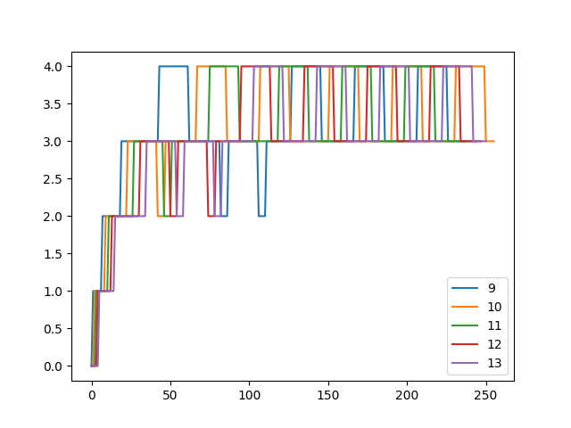

# REPORT

## Specification 1: System Calls

### `trace`

Modificatons made:

1. Makefile: Added `$U/_strace\` to UPROGS
2. proc.h: Added a variable `int mask` 
3. proc.c : Added `np->mask = p->mask;` to fork funtion
4. syscall.c: 
    + Added `extern uint64 sys_trace(void);``
    + Added `[SYS_trace] sys_trace` under syscall mapping fucntion
    + Created 2 arrays `nargs[]` and `sysnames` to map number o of arguments and index to system call name respectively
    + Modified `syscall` function to print process id, system call name, arguments and return value
5. sysproc.c: Added `sys_trace(void)` which acts a handler for trace system call
6. syscall.h: `#define SYS_trace 24`
7. user.h: `int trace(int);`
8. strace.c: Created a new file to test the trace system call in Users
9. usys.pl: `entry("trace");` 

### `sigalarm` and `sigreturn`

1. Five variables `alarm_flag`, `alarm_interval`, `alarm_handler`, `alarm_time` and `old_trapframe` were added to the `proc` struct. `alarm_flag` is initialized to 0 in `allocproc()`.
1. Makefile: `$U/_alarmtest\` is added
1. `sigalarm` and `sigreturn` are declared in `kernel/def.h`
1. `sigalarm` and `sigreturn` are defined in `kernel/proc.c`
1. `alarm_flag` is set to 1, `alarm_interval` is set to `ticks`, `alarm_handler` is set to `handler` and `alarm_time` is set to 0 in `sigalarm`
1. `kernel/trap.c`: if `alarm_flag` is set to 1, `alarm_time` is incremented. If `alarm_time` becomes gereater than `alarm_interval`, the process's trapframe is saved in `old_trapframe`, `alarm_time` and `alarm_flag` is set to 0. To call the function handler the PC is set to the function handler.
1. The appropriate declarations and definations of the system calls are done in `syscall.c`, `syscall.h` and `sysproc.c`.
1. `sigreturn` restores the trapframe of the process, set `alarm_flag` to 1 and `alarm_time` to 0. It also returns `old_trapframe.a0`

## Specification 2: Scheduling

Added support for a `SCHEDULER` macro during `make`. For example `make qemu SCHEDULER=FCFS` can be used to choose the FCFS scheduler.

### FCFS

1. A new variable `creation_time` was added to the `proc` struct. This maintained the values of ticks that were elapsed when the process was created. This variable was initialised in `allocproc()`.
1. Preemption was prevented by disabling timer interupts by not calling `yield()` in `usertrap()` and `kerneltrap()` in `kernel/trap.c`
1. This scheduling algorithm picks the a process with `RUNNABLE` state that has the least `creation_time` value and lets it run, until it finishes using the CPU

### LBS

1. A new variable `tickets` was added to the `proc` struct. This variable is initialized to 1 in `allocproc()`. Value of this variable can be modified using the `settickets(tickets)` system call.
1. `np->tickets = p->tickets` was added to fork to ensure that a child process recieves the same tickets as its parent.
1. `total_tickets` maintians the sum of tickets of all `RUNNABLE` processes.
2. `random_ticket` is initialized by the pseudo-random function `random_at_most(tickets)` which produces a random number from 1 to `total_tickets`.
1. `ticket_count` maintains the culmulative sum of `RUNNABLE` processes in the for loop and the process where `ticket_count` becomes greater than the `random_ticket` is scheduled for execution for one time slice.

### PBS

1. Four new variables `static_priority`, `sleeping_time`, `num_sched` and `running_time` were added to the `proc` struct. `static_priority` is initialized to 60 while the rest of them are initialized to 0 in `allocproc()`.
1. `sleeping_time` and `running_time` is incremented in `update_time()` when the process is `SLEEPING` and `RUNNING` respectively. They record for how many ticks the process was sleeping and running from the last
time it was scheduled.
1. `num_sched` is incremented every time the process is scheduled.
1. Preemption was prevented by disabling timer interupts by not calling `yield()` in `usertrap()` and `kerneltrap()` in `kernel/trap.c`
1. The system call `set_priority()` is implemented which can change the static priority and to reset the niceness, `sleeping_time`, and `running_time` are set to 0.
1. The scheduler chooses the process by calculating the `dynamic_priority` and choosing one with the least for execution.

### MLFQ

1. Three new variables `queue`, `queued`, and `wait_time` were added to the `proc` struct while also using the `running_time` from PBS.
1. A 2-d array of process pointers `mlfq` was created. Each array represented a queue. `mlfq_pointers` stored the head and tail positions of the respective queues.
1. `queue` variable stored in which queue the process was present and `queued` stored whether the process is queued or not.
1. `wait_time` and `running_time` is incremented in `update_time()` when the process is `RUNNABLE` and `RUNNING` respectively. They record for how many ticks the process was waiting and running from the last
time it was scheduled.
1. If the `running_time` exceeds the time slice for the the queue it is in, it is made to reliquish control of the CPU and is pushed to the end to the next lower priority queue.
1. If the `wait_time` of any process exceed the maximum alloted wait time for the queue, the process is removed from that queue and is pushed to the end of the next higher priority queue.
1. The scheduler applies round-robin on the leadt queue having `RUNNABLE` processes.

## Specification 4: Copy on Write

1. vm.c: changed `umvcopy` to not allocate the new physical address.
2. kalloc.c: defined `ref_count` and changed `kalloc.c`,`kfree.c` and added a new function `increase`
3. trap.c: handle function in Trap 
4. kalloc.c: added `int cowfault` 
5. `cowfault()` is also called in the `copyout()` function to handle the case when the `dstva` points to a read-only memory set by CoW.

## How a CPU-bound process might exploit MLFQ

According to the implemented algorithm, a process that voulantarily reliquishes control of the CPU before its time-slice expires stays in the same queue.

Consider a process with using the CPU for an amount just less than the time slice of a queue before making a short I/O request. This means that this process will be put back to the same priority queue very fast.
This will ensure that it remains in the same queue for the entirity of its execution.

A process with the knowledge of the time-slice of each queue may use this to its advantage to stay in a higher priority queue and explot maximum CPU time.

## Performance Analysis

  |        Scheduler         | rtime  | wtime |
  | :----------------------: | :-----: | :-----: |
  |       Round robin        |    2    |   136   |
  |  First come first serve  |    2    |   131   |
  | Lottery based scheduler  |    2    |   142   |
  | Priority Based Scheduler |    3    |   125   |
  |             MLFQ Scheduler             |  2  |     133   |

The above results are obtained by running `schedulertest` on a single CPU.

## MLFQ Schduling Analysis

