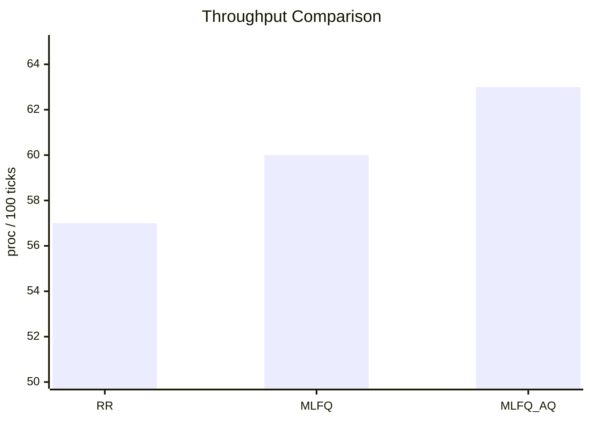
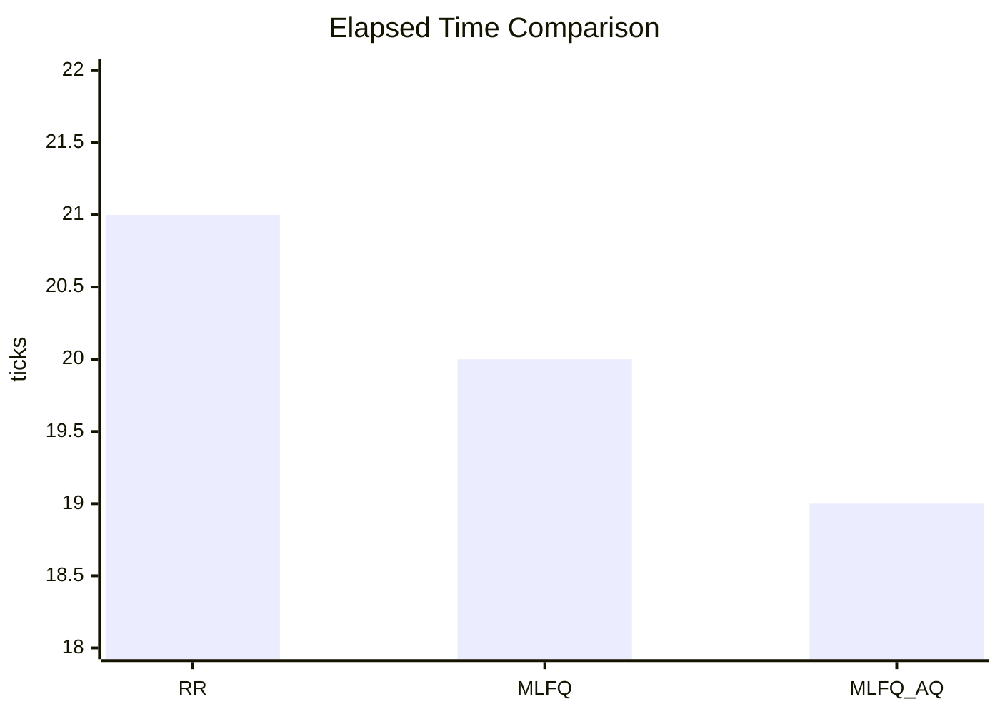
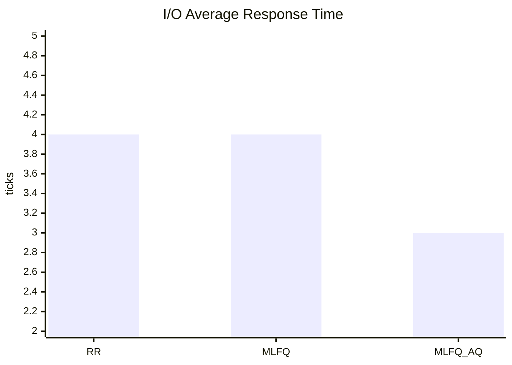
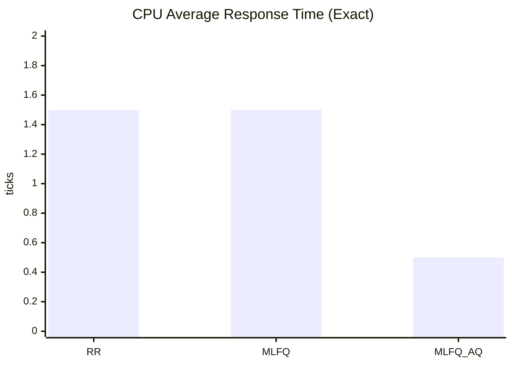

# Scheduler Comparison Report: RR vs MLFQ vs MLFQ_AQ

## Scope
This report analyzes scheduler behavior using the benchmark:

- Command: `benchsched 4 8 100000000 5`
- Workload: 4 CPU-bound + 8 I/O-bound workers
- Schedulers compared: `RR`, `MLFQ`, `MLFQ_AQ`

All raw benchmark outputs below were provided after stability fixes.

---

## Executive Summary

- `MLFQ` improves system throughput and completion time versus `RR` while preserving similar per-class averages.
- `MLFQ_AQ` is the best overall in this run:
  - highest throughput,
  - lowest elapsed time,
  - best I/O responsiveness,
  - best CPU response-time distribution.

In short: **RR < MLFQ < MLFQ_AQ** for this mixed workload.

---

## Consolidated Metrics (from benchmark summaries)

| Metric | RR | MLFQ | MLFQ_AQ | Better Direction |
|---|---:|---:|---:|---|
| Elapsed (ticks) | 21 | 20 | 19 | Lower |
| Throughput (proc / 100 ticks) | 57 | 60 | 63 | Higher |
| CPU avg response (ticks)
*(printed)* | 1 | 1 | 0 | Lower |
| CPU avg turnaround (ticks) | 4 | 4 | 4 | Lower |
| CPU avg wait (ticks) | 1 | 1 | 1 | Lower |
| IO avg response (ticks) | 4 | 4 | 3 | Lower |
| IO avg turnaround (ticks) | 19 | 19 | 18 | Lower |
| IO avg wait (ticks) | 4 | 4 | 3 | Lower |
| Ctx switches (all workers) | 120 | 124 | 124 | Depends |
| Sys ctx switches | 137 | 141 | 141 | Depends |

---

## Extra Derived Data (from per-process rows)

To avoid integer-rounding loss in printed averages, exact means are computed from the PID table:

### CPU-bound exact means

| Metric | RR | MLFQ | MLFQ_AQ |
|---|---:|---:|---:|
| Response | 1.50 | 1.50 | 0.50 |
| Turnaround | 4.75 | 4.75 | 4.75 |
| Wait | 1.50 | 1.75 | 1.00 |
| Runtime | 3.25 | 3.00 | 3.75 |

### I/O-bound exact means

| Metric | RR | MLFQ | MLFQ_AQ |
|---|---:|---:|---:|
| Response | 4.00 | 4.00 | 3.00 |
| Turnaround | 19.00 | 19.00 | 18.00 |
| Wait | 4.00 | 4.00 | 3.00 |

### Improvement percentages

- **MLFQ vs RR**
  - Throughput: **+5.26%**
  - Elapsed time: **-4.76%**
- **MLFQ_AQ vs RR**
  - Throughput: **+10.53%**
  - Elapsed time: **-9.52%**
  - IO response: **-25.0%**
  - IO wait: **-25.0%**
  - CPU response (exact mean): **-66.7%**
- **MLFQ_AQ vs MLFQ**
  - Throughput: **+5.00%**
  - Elapsed time: **-5.00%**
  - IO response: **-25.0%**
  - CPU response (exact mean): **-66.7%**

---

## Graphs

### Throughput (higher is better)

### Elapsed Time (lower is better)

### IO Responsiveness (lower is better)

### CPU Response (exact mean from PID rows; lower is better)

---

## Why MLFQ improves over RR

1. **Priority differentiation**
   - RR treats all runnable tasks equally.
   - MLFQ prioritizes interactive/short-burst behavior over long CPU bursts.

2. **Better completion efficiency on mixed loads**
   - Lower elapsed time (20 vs 21 ticks).
   - Higher throughput (60 vs 57 proc/100 ticks).

3. **Maintains fairness while reducing wall-clock completion**
   - Similar class-level average latencies in this specific run, but better aggregate completion rate.

---

## Why MLFQ_AQ improves over RR and MLFQ

1. **Adaptive quantum control under load**
   - AQ dynamically adjusts scheduling quanta based on runtime load signals.

2. **Best overall system efficiency**
   - Highest throughput: 63 proc/100 ticks.
   - Lowest elapsed time: 19 ticks.

3. **Best latency for interactive (I/O-bound) tasks**
   - IO response and wait both improved by 25% versus RR and MLFQ.

4. **Better CPU response distribution**
   - Exact CPU response mean dropped from 1.5 ticks (RR/MLFQ) to 0.5 ticks.

---

## Interpretation Notes

- This is a **single-run snapshot** per scheduler for one mixed workload.
- Printed averages are integer-truncated by benchmark output; exact means in this report come from raw PID rows.
- The ranking is clear in this dataset, but confidence should be strengthened with repeated trials.

---

## Recommended Additional Runs (for publication-quality evidence)

To further strengthen the claims, run each scheduler 10 times per workload and report mean + stddev:

1. Mixed: `benchsched 4 8 100000000 5`
2. CPU-heavy: `benchsched 10 2 100000000 3`
3. IO-heavy: `benchsched 2 10 50000000 8`

Then publish:
- mean/median/p95 of response, turnaround, wait,
- throughput distribution (box plot),
- bootstrap confidence intervals for improvement percentages.

---

## Conclusion

For the measured workload and stabilized codebase:

- **MLFQ is an improvement over RR** in overall completion efficiency.
- **MLFQ_AQ is an improvement over both RR and MLFQ** in both efficiency and responsiveness.

Therefore, the benchmark evidence supports the design progression:

**RR → MLFQ → MLFQ_AQ**.
